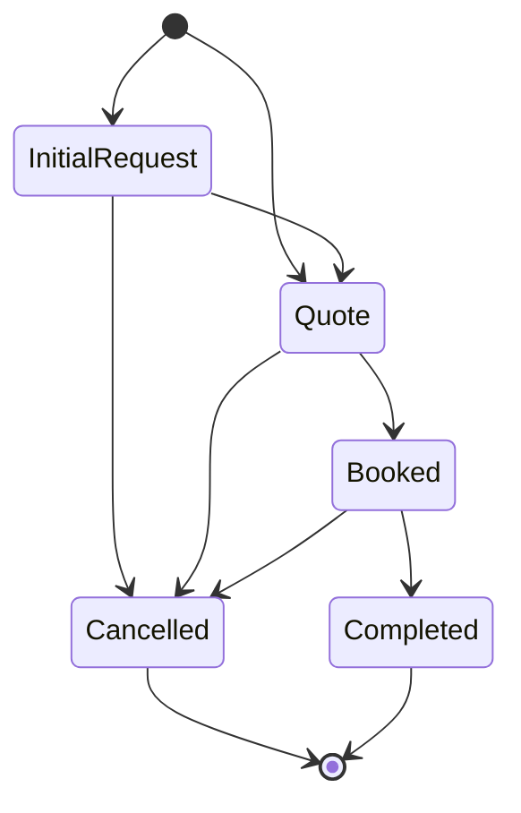
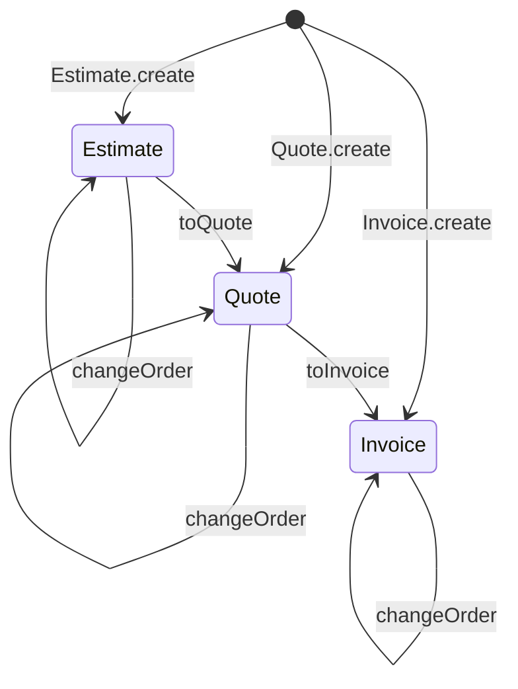

# commerce-domain

[](https://github.com/castab/booking-lifecycle/actions/workflows/ci.yml)

A small Kotlin/JVM library of immutable commerce domain models and lifecycle APIs that
multiple applications can share.

> **Requires Java 25.** The library is compiled to Java 25 bytecode, tested on Java 25,
> and requires a Java 25 or newer runtime. Older JVMs are not supported. See
> [Requirements](#requirements).

```text
io.github.castab:commerce-domain:<version>
```

It currently contains two independent domains:

| Domain | Package | What it provides |
|---|---|---|
| [Booking lifecycle](#booking-lifecycle) | `io.github.castab.commerce.booking.lifecycle` | A type-level protocol for the phases of a booking (`InitialRequest → Quote → Booked → Completed`, or `Cancelled`). Your application's own types implement the phases. |
| [Financial documents](#financial-documents) | `io.github.castab.commerce.financial` | Immutable, versioned commercial documents (`Estimate → Quote → Invoice`) with line items, change orders, derived totals, and persistence-agnostic history lookup. |

Neither domain depends on the other. An application can use one, the other, or
[both together](#using-both-domains-together).

The two domains share one design stance. Lifecycle progression is expressed by the type
system rather than a mutable status field: an operation that is not legal in a stage or
phase does not exist on that type. The library stays free of persistence, frameworks,
serialization, and payment concerns. Its only runtime dependency is `kotlin-stdlib`.

## Contents

- [Installation](#installation)
- [Booking lifecycle](#booking-lifecycle)
- [Financial documents](#financial-documents)
- [Using both domains together](#using-both-domains-together)
- [What this library is not](#what-this-library-is-not)
- [Requirements](#requirements)
- [Building and testing](#building-and-testing)
- [Releasing](#releasing)
- [Current scope](#current-scope)
- [Future direction](#future-direction)
- [License](#license)

## Installation

Releases are published to **GitHub Packages** as a Maven artifact:

| | |
|---|---|
| Coordinates | `io.github.castab:commerce-domain:<version>` |
| Repository | `https://maven.pkg.github.com/castab/booking-lifecycle` (the GitHub repository that publishes the package) |
| Versions | [GitHub Releases](https://github.com/castab/booking-lifecycle/releases). A release tagged `v0.0.1` is published as version `0.0.1`. |

A consuming build needs **both** the repository declaration and the dependency.
`mavenCentral()` alone is not enough.

Gradle (Kotlin DSL):

```kotlin
// build.gradle.kts (or dependencyResolutionManagement in settings.gradle.kts)
repositories {
    mavenCentral()
    maven {
        url = uri("https://maven.pkg.github.com/castab/booking-lifecycle")
        credentials {
            username = providers.gradleProperty("gpr.user").orNull ?: System.getenv("GITHUB_ACTOR")
            password = providers.gradleProperty("gpr.key").orNull ?: System.getenv("GITHUB_TOKEN")
        }
        // Only ask GitHub Packages for this library's group.
        content {
            includeGroup("io.github.castab")
        }
    }
}

dependencies {
    implementation("io.github.castab:commerce-domain:0.0.1")
}
```

Maven:

```xml
<!-- pom.xml -->
<repositories>
  <repository>
    <id>github-castab</id>
    <url>https://maven.pkg.github.com/castab/booking-lifecycle</url>
  </repository>
</repositories>

<dependencies>
  <dependency>
    <groupId>io.github.castab</groupId>
    <artifactId>commerce-domain</artifactId>
    <version>0.0.1</version>
  </dependency>
</dependencies>
```

For Maven, put the credentials in a `<server>` with the same `<id>` (`github-castab`) in
your user-level `~/.m2/settings.xml`, never in the project's `pom.xml`.

The consuming project must also build and run on Java 25 (for example,
`kotlin { jvmToolchain(25) }` or `<maven.compiler.release>25</maven.compiler.release>`).

### Authentication is required, even for public packages

GitHub Packages' Maven registry requires authentication to **download** packages,
including public ones.

- **On your machine:** create a GitHub personal access token (classic) with the
  `read:packages` scope, and put it in your **user-level** Gradle properties file,
  `~/.gradle/gradle.properties`:

  ```properties
  gpr.user=<your-github-username>
  gpr.key=<your-personal-access-token>
  ```

  These credentials belong to you, not to any project. Never put tokens in a
  repository's `build.gradle.kts`, `settings.gradle.kts`, or `gradle.properties`, and
  never commit them.

- **In GitHub Actions:** provide `GITHUB_ACTOR` and `GITHUB_TOKEN` to the Gradle step
  (for example, `env: GITHUB_TOKEN: ${{ secrets.GITHUB_TOKEN }}`) and give the job
  `packages: read` permission. A workflow's `GITHUB_TOKEN` can read the package only if
  the consuming repository has been granted read access to it in the package's access
  settings. Otherwise, store a classic personal access token with `read:packages` as an
  Actions secret and use that instead.

### Local development against a checkout

To build against an unreleased local checkout instead, use a Gradle
[composite build](https://docs.gradle.org/current/userguide/composite_builds.html). Gradle
substitutes the checkout for the dependency, so no registry or credentials are involved:

```kotlin
// settings.gradle.kts of the consuming build
includeBuild("../commerce-domain") // path to your checkout of this repository
```

```kotlin
// build.gradle.kts of the consuming build
dependencies {
    implementation("io.github.castab:commerce-domain:0.0.0-SNAPSHOT")
}
```

## Booking lifecycle

Package `io.github.castab.commerce.booking.lifecycle`. A type-level lifecycle for expressing
a booking directly through application-owned domain types.

The booking lifecycle does not own your booking data. It gives your booking-domain types a
common lifecycle vocabulary and a compile-time topology of legal transitions.

> The library owns the booking lifecycle type hierarchy and its legal transition topology.
> Consuming applications own the concrete business data and the conditions necessary to
> perform those transitions.

Put shortly: **the library defines what may legally follow a lifecycle phase. Your
application defines whether, when, and how that transition occurs.**

### Why this exists

Many applications agree that a booking moves through the same broad phases:

```text
InitialRequest → Quote → Booked → Completed
```

They disagree completely about what the objects in those phases contain. A caterer's
booking might carry:

```text
customer, menu selections, guest count, deposit, invoice
```

An equipment rental's booking might carry:

```text
renter, equipment list, rental dates, security hold
```

The two apps share the lifecycle topology: which phases exist and which may follow which.
They don't share business data. The booking lifecycle captures the shared part and leaves the rest
to each application.

### The core idea

**Application models implement lifecycle phase interfaces directly.**

```kotlin
data class CateringQuote(
    val customerId: UUID,
    val total: BigDecimal,
) : BookingLifecycle.Active.Quote {
    // transition implementations, shown below
}
```

`CateringQuote` does not *contain* the `Quote` phase. It *is* your application's
concrete representation of the `Quote` phase.

This library is deliberately **not** centered on a state property such as:

```kotlin
data class Booking(
    val state: BookingState, // not the model this library is built around
)
```

A lifecycle does not advance by mutating a `state` field. It advances when one
lifecycle-typed application model is transformed into the next:
`CateringQuote.toBooking()` returns a `CateringBooking`.

### Lifecycle



The transition functions on each phase:

```text
InitialRequest
 ├── toQuote() ───→ Quote
 └── cancel() ────→ Cancelled

Quote
 ├── toBooking() ─→ Booked
 └── cancel() ────→ Cancelled

Booked
 ├── complete() ──→ Completed
 └── cancel() ────→ Cancelled

Completed
 └── no lifecycle transitions

Cancelled
 └── no lifecycle transitions
```

#### Two entry points

A lifecycle can begin at either of two phases:

- **`InitialRequest`**: a customer submits an inquiry through your application.
- **`Quote`**: the opportunity started outside your application (a phone call, a text,
  an email, an in-person conversation, another system), and the first thing your
  application records is an issued quote.

There is no library-owned factory or initial value. A lifecycle begins when you
construct a model that implements one of these two phases.

#### Phases

| Phase | Classification | Meaning | Legal transitions |
|---|---|---|---|
| `InitialRequest` | Active | An inquiry or estimate request that has not yet become an official quote. | `toQuote()`, `cancel()` |
| `Quote` | Active | A booking opportunity for which an official quote has been issued. It can also be the entry point. | `toBooking()`, `cancel()` |
| `Booked` | Active | A confirmed booking. The library does not define what "confirmed" requires. | `complete()`, `cancel()` |
| `Cancelled` | Terminal | The lifecycle ended without fulfillment. | none |
| `Completed` | Terminal | The booked service or event was fulfilled. | none |

The application owns what each phase contains. An `InitialRequest` might hold customer
details, selections, notes, an estimate, or a requested date, but the lifecycle requires
none of these.

### Lifecycle API

This is the entire booking lifecycle API. It lives in
[`BookingLifecycle.kt`](src/main/kotlin/io/github/castab/commerce/booking/lifecycle/BookingLifecycle.kt),
shown here without KDoc:

```kotlin
package io.github.castab.commerce.booking.lifecycle

public sealed interface BookingLifecycle {

    public sealed interface Active : BookingLifecycle {

        public interface InitialRequest : Active {
            public fun toQuote(): Quote
            public fun cancel(): Terminal.Cancelled
        }

        public interface Quote : Active {
            public fun toBooking(): Booked
            public fun cancel(): Terminal.Cancelled
        }

        public interface Booked : Active {
            public fun complete(): Terminal.Completed
            public fun cancel(): Terminal.Cancelled
        }
    }

    public sealed interface Terminal : BookingLifecycle {

        public interface Cancelled : Terminal

        public interface Completed : Terminal
    }
}
```

#### Why some interfaces are sealed and others open

```text
BookingLifecycle          sealed   (the library controls the taxonomy)
├── Active                sealed
│   ├── InitialRequest    open     (your types implement these)
│   ├── Quote             open
│   └── Booked            open
└── Terminal              sealed
    ├── Cancelled         open
    └── Completed         open
```

- **Sealed classifications.** `BookingLifecycle`, `Active`, and `Terminal` are sealed,
  so the set of phases is fixed by the library. Another module cannot add a sixth phase.
  The compiler rejects it with "Extending sealed classes or interfaces from a different
  module is prohibited". This also makes `when` over a `BookingLifecycle` exhaustive
  without an `else` branch.
- **Open phases.** The five phase interfaces are ordinary interfaces. Kotlin only
  restricts the *direct* subtypes of a sealed type to the declaring module, so your
  classes in any module can implement a phase:

```text
BookingLifecycle.Active.Quote              BookingLifecycle.Active.Quote
            ▲                                          ▲
            │                                          │
      CateringQuote                              EquipmentQuote
   (catering application)                    (rental application)
```

The library controls the lifecycle vocabulary. Your application controls the concrete
representation.

Code that only knows the protocol can still handle any adopter's models exhaustively:

```kotlin
fun describe(phase: BookingLifecycle): String =
    when (phase) {
        is BookingLifecycle.Active.InitialRequest -> "Inquiry received"
        is BookingLifecycle.Active.Quote -> "Quote issued"
        is BookingLifecycle.Active.Booked -> "Booked"
        is BookingLifecycle.Terminal.Completed -> "Completed"
        is BookingLifecycle.Terminal.Cancelled -> "Cancelled"
    }
```

### Implementing the lifecycle

Below is a complete application-owned chain for a catering business. It lives in the
application's own package. Every field and every type other than `BookingLifecycle`
belongs to the application, including `bookingId`: the library does not define booking
identity.

```kotlin
package com.example.catering

import io.github.castab.commerce.booking.lifecycle.BookingLifecycle
import java.math.BigDecimal
import java.time.LocalDate
import java.util.UUID

data class MenuSelection(val item: String, val servings: Int)

data class CateringInitialRequest(
    val bookingId: UUID,
    val customerId: UUID,
    val eventDate: LocalDate,
    val selections: List<MenuSelection>,
    val estimatedTotal: BigDecimal,
) : BookingLifecycle.Active.InitialRequest {

    override fun toQuote(): CateringQuote =
        CateringQuote(bookingId, customerId, eventDate, selections, total = estimatedTotal)

    override fun cancel(): CancelledCateringInquiry =
        CancelledCateringInquiry(bookingId, customerId)
}

data class CateringQuote(
    val bookingId: UUID,
    val customerId: UUID,
    val eventDate: LocalDate,
    val selections: List<MenuSelection>,
    val total: BigDecimal,
    val revision: Int = 1,
) : BookingLifecycle.Active.Quote {

    // A revision is application data. The result still inhabits the Quote phase.
    fun revise(newTotal: BigDecimal): CateringQuote =
        copy(total = newTotal, revision = revision + 1)

    override fun toBooking(): CateringBooking =
        CateringBooking(bookingId, customerId, eventDate, selections, invoiceTotal = total)

    override fun cancel(): DeclinedCateringQuote =
        DeclinedCateringQuote(bookingId, customerId, quotedTotal = total)
}

data class CateringBooking(
    val bookingId: UUID,
    val customerId: UUID,
    val eventDate: LocalDate,
    val selections: List<MenuSelection>,
    val invoiceTotal: BigDecimal,
    val invoiceVersion: Int = 1,
) : BookingLifecycle.Active.Booked {

    // A change order produces a new invoice version. The result still inhabits Booked.
    fun applyChangeOrder(added: MenuSelection, cost: BigDecimal): CateringBooking =
        copy(
            selections = selections + added,
            invoiceTotal = invoiceTotal + cost,
            invoiceVersion = invoiceVersion + 1,
        )

    override fun complete(): CompletedCateringBooking =
        CompletedCateringBooking(bookingId, customerId, eventDate, finalTotal = invoiceTotal)

    override fun cancel(): CancelledCateringBooking =
        CancelledCateringBooking(bookingId, customerId, eventDate)
}

data class CompletedCateringBooking(
    val bookingId: UUID,
    val customerId: UUID,
    val eventDate: LocalDate,
    val finalTotal: BigDecimal,
) : BookingLifecycle.Terminal.Completed

data class CancelledCateringInquiry(
    val bookingId: UUID,
    val customerId: UUID,
) : BookingLifecycle.Terminal.Cancelled

data class DeclinedCateringQuote(
    val bookingId: UUID,
    val customerId: UUID,
    val quotedTotal: BigDecimal,
) : BookingLifecycle.Terminal.Cancelled

data class CancelledCateringBooking(
    val bookingId: UUID,
    val customerId: UUID,
    val eventDate: LocalDate,
) : BookingLifecycle.Terminal.Cancelled
```

Walking the canonical path:

```kotlin
val request = CateringInitialRequest(
    bookingId = UUID.randomUUID(),
    customerId = UUID.randomUUID(),
    eventDate = LocalDate.of(2026, 11, 14),
    selections = listOf(MenuSelection("Tamales", servings = 80)),
    estimatedTotal = BigDecimal("1200.00"),
)

val quote: CateringQuote = request.toQuote()
val booking: CateringBooking = quote.toBooking()
val completed: CompletedCateringBooking = booking.complete()

// or, as one expression
request.toQuote().toBooking().complete()
```

The application also picks a concrete cancellation type for each point where the
lifecycle can end: `CancelledCateringInquiry`, `DeclinedCateringQuote`, and
`CancelledCateringBooking`. All three implement `BookingLifecycle.Terminal.Cancelled`. The
protocol cares about the outcome. The application keeps control of the data that
records it.

### Legal paths are expressed by capabilities

The transition methods are the state machine. The library has no separate transition
table, runtime validator, or `transition(from, to)` function. Each phase exposes only the
transitions that may legally follow it.

`Quote.toBooking()` expresses that `Quote → Booked` is a valid lifecycle edge. An edge
that is not legal has no method, so calling it does not compile:

```kotlin
initialRequest.complete()   // error: Unresolved reference 'complete'   (InitialRequest cannot complete)
initialRequest.toBooking()  // error: Unresolved reference 'toBooking'  (it must be quoted first)
quote.complete()            // error: Unresolved reference 'complete'   (a quote must be booked first)
completed.cancel()          // error: Unresolved reference 'cancel'     (terminal phases have no transitions)
completed.toBooking()       // error: Unresolved reference 'toBooking'
cancelled.toQuote()         // error: Unresolved reference 'toQuote'
```

Illegal paths are not rejected at runtime, because they cannot be written in the first
place. `Completed` and `Cancelled` declare no members at all, so there is no
lifecycle-native way to leave a terminal phase.

This design makes the right path easy. It does not sandbox your code. Nothing stops an
application from constructing a `CompletedCateringBooking` directly, and nothing in
the type system stops a single class from implementing two phases. Phases are meant to be
mutually exclusive, so give each concrete type exactly one phase interface. The library
makes the canonical lifecycle natural and leaves illegal edges out of the lifecycle API.
It does not police all application code.

### The library defines legality, not business policy

> Transition methods represent legal lifecycle edges, not the business prerequisites
> necessary to traverse those edges.

`fun toBooking(): Booked` means that `Quote → Booked` is a legal lifecycle transition. It
does **not** mean the library has checked that the booking's business requirements are
met. The booking lifecycle has no concept of deposits, payments, contracts, acceptance,
approval, availability, identity, timestamps, or actors.

Each application decides for itself. For example, a caterer that requires an accepted quote
and a 25% deposit before confirming might write:

```kotlin
data class CateringQuote(
    // ...fields as above, plus:
    val acceptedAt: Instant?,
    val depositReceived: BigDecimal,
) : BookingLifecycle.Active.Quote {

    override fun toBooking(): CateringBooking {
        checkNotNull(acceptedAt) { "Quote for booking $bookingId has not been accepted" }
        require(depositReceived >= total * DEPOSIT_RATE) { "Deposit for booking $bookingId is below 25%" }
        return CateringBooking(bookingId, customerId, eventDate, selections, invoiceTotal = total)
    }

    // cancel() as before

    private companion object {
        val DEPOSIT_RATE = BigDecimal("0.25")
    }
}
```

An equipment rental business may confirm unconditionally:

```kotlin
data class EquipmentQuote(
    val renterId: UUID,
    val equipment: List<String>,
    val rentalDates: ClosedRange<LocalDate>,
    val securityHold: BigDecimal,
) : BookingLifecycle.Active.Quote {

    override fun toBooking(): EquipmentRental =
        EquipmentRental(renterId, equipment, rentalDates, securityHold)

    override fun cancel(): ExpiredEquipmentQuote =
        ExpiredEquipmentQuote(renterId)
}
```

A third might require a signed contract, and a fourth, staff approval. These are all
valid adopters. The checks above are examples of *one* application's policy, not
requirements of the protocol. How a failed check is reported (exception, `Result`,
sealed outcome, or a check performed before `toBooking()` is ever called) is also the
application's choice.

### Covariant concrete return types

The protocol declares the most general return type:

```kotlin
public fun toBooking(): BookingLifecycle.Active.Booked
```

Kotlin allows an override to return a subtype, so an adopter can declare its own type:

```kotlin
override fun toBooking(): CateringBooking   // CateringBooking : BookingLifecycle.Active.Booked
```

Callers holding the concrete type keep concrete types through the whole lifecycle, with
no casts:

```kotlin
val booking: CateringBooking = quote.toBooking()
val completed: CompletedCateringBooking = booking.complete()
```

Callers holding only the protocol type get the protocol type:

```kotlin
val someQuote: BookingLifecycle.Active.Quote = quote
val someBooking: BookingLifecycle.Active.Booked = someQuote.toBooking()
```

### Application-owned data

The booking lifecycle does not own, define, or constrain any of the following:

- customer models or customer identity
- staff identity or actors
- booking identity (how a quote and its booking are known to be the same booking)
- selections, line items, or estimates
- quote contents and quote versions
- invoice details and invoice versions
- payments and deposits
- cancellation reasons
- refunds and complaints
- timestamps
- persistence structure

Every example type above (`MenuSelection`, `CateringQuote`, `bookingId`, `invoiceVersion`,
...) is application code. The booking lifecycle compiles without knowing what any of it means.

An application that wants versioned, immutable quote and invoice documents can hold
[financial documents](#financial-documents) inside its phase models. See
[Using both domains together](#using-both-domains-together). The booking lifecycle itself
stays independent of them.

### Quote and invoice revisions

Revisions change data *within* a phase. They do not move a booking to another phase.

```text
Quote v1  →  Quote v2  →  Quote v3          (still Quote)

Invoice v1 → change order → Invoice v2 → change order → Invoice v3   (still Booked)
```

In the catering example:

```kotlin
val revised: CateringQuote = quote
    .revise(BigDecimal("1150.00"))
    .revise(BigDecimal("1100.00"))          // revision == 3, still a BookingLifecycle.Active.Quote

val changed: CateringBooking = revised.toBooking()
    .applyChangeOrder(MenuSelection("Churros", servings = 80), BigDecimal("160.00"))
    .applyChangeOrder(MenuSelection("Horchata", servings = 80), BigDecimal("90.00"))
                                            // invoiceVersion == 3, still a BookingLifecycle.Active.Booked
```

Quote revisions stay application-owned data while the model continues to inhabit the
`Quote` phase. The same holds for invoice revisions in the `Booked` phase. That is why the
booking lifecycle has no `QuoteRevised`, `InvoiceSent`, or `InvoiceRevised` phase.

### Terminal outcomes

> Terminal booking phases are immutable historical outcomes of the booking lifecycle.

Once a booking reaches `Completed` or `Cancelled`, its lifecycle outcome does not change.
`Completed` means the booked service was fulfilled. `Cancelled` means the lifecycle ended
without fulfillment.

Being terminal with respect to the booking lifecycle **does not** mean all business
activity around the booking has ended:

```text
InitialRequest → Quote → Booked → Completed
                                     ⋮
                         customer complaint → refund
```

The lifecycle is still `Completed`, because the service was fulfilled. Likewise,
`Booked → Cancelled` may be followed by a refund, and the lifecycle is still `Cancelled`,
because fulfillment never happened.

Model such activity as separate, application-owned processes that refer to the booking:

```kotlin
data class Refund(val bookingId: UUID, val amount: BigDecimal, val reason: String)

val refund = Refund(completed.bookingId, BigDecimal("150.00"), reason = "late delivery")
// `completed` is still a BookingLifecycle.Terminal.Completed
```

Those processes can have lifecycles of their own. The combinations below describe
different historical situations, even though money is returned in both:

| Booking lifecycle | Payment process (application-owned) | What happened |
|---|---|---|
| `Completed` | refunded | The service was delivered, then money was returned. |
| `Cancelled` | refunded | The service never happened, and money was returned. |

Payments, refunds, complaints, disputes, chargebacks, invoicing, settlement, customer
support, and accounting are orthogonal to the booking lifecycle. For that reason there
are no phases such as `CompletedRefunded`, `PartiallyRefunded`, `DepositPaid`,
`ChargebackReceived`, or `ComplaintOpened`.

## Financial documents

Package `io.github.castab.commerce.financial`. Immutable, versioned commercial documents:
estimates, quotes, and invoices.

Unlike the booking lifecycle, these are concrete library-owned types. The library enforces
the invariants that every application needs from a financial document: one identity per
lineage, gap-free versions, legal stage transitions, a single currency, and totals that
always agree with the line items. The application supplies the line items and decides when
each operation happens.

### Lifecycle



```text
Estimate
 ├── changeOrder() → Estimate
 └── toQuote() ────→ Quote

Quote
 ├── changeOrder() → Quote
 └── toInvoice() ──→ Invoice

Invoice
 └── changeOrder() → Invoice   (no further lifecycle transition)
```

A lineage can **start at any stage**:

| Entry point | Typical use |
|---|---|
| `FinancialDocument.Estimate.create(...)` | You give preliminary estimates before quoting. |
| `FinancialDocument.Quote.create(...)` | You don't use estimates and issue quotes directly. |
| `FinancialDocument.Invoice.create(...)` | You invoice immediately, for example at a point of sale. |

Once a lineage exists it only moves forward, one stage at a time. There is no
`Estimate.toInvoice()` shortcut and no reverse transition (`Quote.toEstimate()`,
`Invoice.toQuote()`, `Invoice.toEstimate()`). Those calls don't compile. Starting a
lineage as an invoice is a different thing from converting an estimate into one: the
first is a supported entry point, and the second is deliberately impossible.

| Stage | Meaning |
|---|---|
| `Estimate` | A preliminary, non-binding statement of expected charges. |
| `Quote` | A formal offer to provide the listed items at the stated amounts. |
| `Invoice` | A request for payment of the listed items at the stated amounts. It describes what is owed, not whether it has been paid. |

The stage *is* the type. `FinancialDocument` is a sealed class with exactly three
subclasses, so a `when` over a document is exhaustive, and there is no `type` or `stage`
property to change.

### Snapshots, lineages, and versions

A `FinancialDocument` is one immutable snapshot. Nothing modifies it. Every change order
and every transition returns a **new** snapshot:

- with the same `id` (a `java.util.UUID` that identifies the whole lineage),
- at `version.next()`,
- with `previousVersion` equal to the source's `version`.

```text
ABC v1 Estimate
    ↓ changeOrder
ABC v2 Estimate
    ↓ toQuote
ABC v3 Quote
    ↓ changeOrder
ABC v4 Quote
    ↓ toInvoice
ABC v5 Invoice
    ↓ changeOrder
ABC v6 Invoice
```

Every snapshot exposes:

```kotlin
val id: UUID
val version: Version                          // starts at Version.INITIAL (1)
val previousVersion: Version?                 // null only for version 1
val lineItems: List<LineItem>
val currency: Currency
val subtotal: Money                           // derived
val taxAmount: Money                          // derived
val total: Money                              // derived
val reference: FinancialDocumentReference             // (id, version)
val previousReference: FinancialDocumentReference?    // (id, previousVersion)
```

`Version` is a small value type. `Version.INITIAL` is 1, `version.next()` is the next
version, and `Version.of(37)` reconstructs a stored version. `Version.of(0)` and
`Version.of(-1)` are rejected.

A `FinancialDocumentReference(id, version)` identifies exactly one snapshot. It never
contains the snapshot. Snapshots don't embed their predecessors, so loading version 1,000
of a document loads one snapshot, not a chain of 999 earlier ones.

The document types have private constructors and no `copy()`. Callers cannot invent a
version, a previous-version link, or a stage transition. The only ways to obtain a
snapshot are the `create` entry points, the lifecycle operations, and `restore` for
persistence adapters (see [History and persistence](#history-and-persistence)).

### Line items and money

```kotlin
data class LineItem(
    val id: UUID,
    val description: String,
    val subDescription: String? = null,
    val quantity: BigDecimal?,
    val price: Money,
    val taxAmount: Money,
) {
    val currency: Currency
    val subtotal: Money   // price × quantity, or price when quantity is null
    val total: Money      // subtotal + taxAmount
}

data class Money(val amount: BigDecimal, val currency: Currency)
```

- **Quantity.** When `quantity` is present, `price` is a unit price: 4 × $25 = $100.
  When `quantity` is `null`, the line is flat-priced (a service fee, labor, an
  intangible), and its subtotal is `price`.
- **Tax.** `price` never includes tax. `taxAmount` is the final tax attributable to the
  line, calculated by your application. It is not a rate and not a taxable amount.
  `total = subtotal + taxAmount`.
- **Currency.** `Money` is a `BigDecimal` plus a `java.util.Currency`. Arithmetic is exact,
  with no rounding and no conversion. Adding USD to EUR throws. A line item's `price` and
  `taxAmount` must share a currency, and all line items in a document must share one.
- **Totals are derived.** A document's `subtotal`, `taxAmount`, and `total` are always
  calculated from its line items. No API accepts them, so a document can't claim a total
  that its lines don't add up to.
- **Line item ids** are UUIDs chosen by your application, and must be unique within a
  document. A document needs at least one line item.

Money equality follows `BigDecimal.equals`, so it is scale-sensitive: `10.0 USD` and
`10.00 USD` are not `==`. Compare `amount`s with `compareTo` when you mean numeric equality.

### Change orders

A modification is an explicit, immutable `ChangeOrder` of whole-line-item changes:

```kotlin
ChangeOrder(
    changes = listOf(
        ChangeOrder.Change.AddLineItem(lineItem),                     // id must be new
        ChangeOrder.Change.ReplaceLineItem(lineItemId, replacement),  // id must exist; replacement keeps it
        ChangeOrder.Change.RemoveLineItem(lineItemId),                // id must exist
    ),
)
```

- Changes apply **in order**. A later change sees the result of the earlier ones.
- Application is **atomic**. If any change fails, or the result would be invalid (no line
  items, mixed currencies), `changeOrder` throws `IllegalArgumentException` and there is no
  successor. There is never a partially applied document.
- A replacement must keep the id of the line item it replaces. Revise a line with
  `existing.copy(...)`. There is no field-level patching, so there is never a question of
  whether `null` means "unchanged" or "clear".
- A change order never changes the stage. `Estimate.changeOrder` returns an `Estimate`,
  `Quote.changeOrder` a `Quote`, and `Invoice.changeOrder` an `Invoice`.

### Examples

#### 1–5. Estimate, revise, quote, revise, invoice

```kotlin
import io.github.castab.commerce.financial.ChangeOrder
import io.github.castab.commerce.financial.FinancialDocument
import io.github.castab.commerce.financial.LineItem
import io.github.castab.commerce.financial.Money
import java.math.BigDecimal
import java.util.Currency
import java.util.UUID

val usd = Currency.getInstance("USD")
fun usd(amount: String) = Money(BigDecimal(amount), usd)

val tamales = LineItem(
    id = UUID.randomUUID(),
    description = "Tamales",
    subDescription = "Pork and chicken, by the dozen",
    quantity = BigDecimal("20"),
    price = usd("30.00"),
    taxAmount = usd("48.00"),
)
val serviceFee = LineItem(
    id = UUID.randomUUID(),
    description = "Event service fee",
    quantity = null,                 // flat-priced
    price = usd("250.00"),
    taxAmount = usd("0.00"),
)

// 1. Create an estimate: v1, no previous version.
val estimateV1 = FinancialDocument.Estimate.create(
    id = UUID.randomUUID(),
    lineItems = listOf(tamales, serviceFee),
)
estimateV1.total                      // 898.00 USD  (600.00 + 250.00 + 48.00 tax)

// 2. Revise it with a change order: v2, still an Estimate.
val estimateV2 = estimateV1.changeOrder(
    ChangeOrder(
        changes = listOf(
            ChangeOrder.Change.ReplaceLineItem(
                lineItemId = tamales.id,
                replacement = tamales.copy(quantity = BigDecimal("25"), taxAmount = usd("60.00")),
            ),
        ),
    ),
)

// 3. Convert it to a quote: v3, same id and line items.
val quoteV3: FinancialDocument.Quote = estimateV2.toQuote()

// 4. Revise the quote: v4, still a Quote.
val quoteV4 = quoteV3.changeOrder(
    ChangeOrder(
        changes = listOf(
            ChangeOrder.Change.AddLineItem(
                LineItem(
                    id = UUID.randomUUID(),
                    description = "Horchata",
                    quantity = BigDecimal("3"),
                    price = usd("45.00"),
                    taxAmount = usd("10.80"),
                ),
            ),
        ),
    ),
)

// 5. Convert it to an invoice: v5, previousVersion = v4.
val invoiceV5: FinancialDocument.Invoice = quoteV4.toInvoice()

check(invoiceV5.id == estimateV1.id)
check(invoiceV5.previousVersion == quoteV4.version)
// estimateV1, estimateV2, quoteV3, and quoteV4 are all unchanged.
```

#### 6. Point-of-sale invoice

A sale that never had an estimate or quote starts its lineage as an invoice:

```kotlin
val receipt = FinancialDocument.Invoice.create(
    id = UUID.randomUUID(),
    lineItems = listOf(
        LineItem(
            id = UUID.randomUUID(),
            description = "Coffee beans, 1 lb",
            quantity = BigDecimal("2"),
            price = usd("14.00"),
            taxAmount = usd("2.24"),
        ),
    ),
)
receipt.version                       // v1
receipt.total                         // 30.24 USD
```

The invoice can later be corrected with `receipt.changeOrder(...)`, which produces
version 2 of the same invoice.

### History and persistence

The library never loads history on its own. A snapshot knows its predecessor's
*reference*, and your application supplies the lookup through the
`FinancialDocumentHistory` interface:

```kotlin
interface FinancialDocumentHistory {
    fun retrieveVersion(reference: FinancialDocumentReference): FinancialDocument?
    fun retrieveLatestVersion(id: UUID): FinancialDocument?
}
```

Conceptually, a persisted lineage is **one immutable snapshot per row or document**:

```text
document_id | version | previous_version | stage    | line_items | ...
ABC         | 1       | null             | ESTIMATE | [...]      |
ABC         | 2       | 1                | ESTIMATE | [...]      |
ABC         | 3       | 2                | QUOTE    | [...]      |
```

Historical snapshots are *referenced* by `(document_id, version)`, never embedded
recursively. The library prescribes no tables, collections, entities, or database.
Implement the interface over PostgreSQL, MongoDB, DynamoDB, Redis, an HTTP API, or an
in-memory map. The library doesn't know which. Totals can be stored as denormalized
columns if you like, but they are recalculated from the line items when a snapshot is
restored.

#### 7. Implementing `FinancialDocumentHistory`

An in-memory implementation, useful for tests:

```kotlin
class InMemoryFinancialDocumentHistory : FinancialDocumentHistory {
    private val snapshots = ConcurrentHashMap<FinancialDocumentReference, FinancialDocument>()

    fun save(document: FinancialDocument) {
        check(snapshots.putIfAbsent(document.reference, document) == null) {
            "${document.reference} already exists"   // a concurrent writer got there first
        }
    }

    override fun retrieveVersion(reference: FinancialDocumentReference) = snapshots[reference]

    override fun retrieveLatestVersion(id: UUID) =
        snapshots.values.filter { it.id == id }.maxByOrNull { it.version }
}
```

A database-backed implementation maps rows back into snapshots with the stages' `restore`
factories. This sketch uses JDBI, but any data access works:

```kotlin
class JdbiFinancialDocumentHistory(private val jdbi: Jdbi) : FinancialDocumentHistory {

    override fun retrieveVersion(reference: FinancialDocumentReference): FinancialDocument? =
        jdbi.withHandle<FinancialDocument?, Exception> { handle ->
            handle.createQuery("SELECT * FROM financial_document WHERE document_id = :id AND version = :version")
                .bind("id", reference.id)
                .bind("version", reference.version.number)
                .map { rs, _ -> toDocument(rs) }
                .findOne().orElse(null)
        }

    override fun retrieveLatestVersion(id: UUID): FinancialDocument? = TODO("ORDER BY version DESC LIMIT 1")

    private fun toDocument(rs: ResultSet): FinancialDocument {
        val id = rs.getObject("document_id", UUID::class.java)
        val version = Version.of(rs.getInt("version"))
        val lineItems = readLineItems(rs)                      // your mapping
        return when (rs.getString("stage")) {
            "ESTIMATE" -> FinancialDocument.Estimate.restore(id, version, lineItems)
            "QUOTE" -> FinancialDocument.Quote.restore(id, version, lineItems)
            "INVOICE" -> FinancialDocument.Invoice.restore(id, version, lineItems)
            else -> error("Unknown stage")
        }
    }
}

// Writing: derive the stored stage from the type, not from a status field.
fun stageOf(document: FinancialDocument): String = when (document) {
    is FinancialDocument.Estimate -> "ESTIMATE"
    is FinancialDocument.Quote -> "QUOTE"
    is FinancialDocument.Invoice -> "INVOICE"
}
```

`restore` exists only to rebuild snapshots that were produced earlier through the
lifecycle API. Its previous version is always derived from its version. Use `create` and
the lifecycle operations for new snapshots.

#### 8. Retrieving previous and latest versions

```kotlin
val history: FinancialDocumentHistory = JdbiFinancialDocumentHistory(jdbi)

val previous: FinancialDocument? = invoiceV5.retrievePreviousVersion(from = history)   // v4, one lookup
val latest: FinancialDocument? = estimateV1.retrieveLatestVersion(from = history)      // newest stored snapshot
val v2: FinancialDocument? = invoiceV5.retrieveVersion(Version.of(2), from = history)  // one lookup, skips v3 and v4
```

- `retrievePreviousVersion` looks only at `previousVersion`. For version 1 it returns `null`
  without calling the history at all. Otherwise it performs exactly one lookup, for exactly
  `(id, previousVersion)`. It never walks further back.
- `retrieveLatestVersion` delegates with the document's `id`.
- `retrieveVersion` performs one lookup for `(id, version)` and does not retrieve any
  intervening versions.
- Each helper checks that the history returned the snapshot it was asked for.

To walk back further, call `retrievePreviousVersion` again on the result. Each step is
one explicit lookup that you choose to make.

### Concurrency

The library has no locks, registries, transactions, or global state. Two processes that
both hold `ABC v7` can each compute a perfectly valid `ABC v8`. Deciding which one is
stored is the persistence layer's job, normally with a uniqueness constraint or an
optimistic-concurrency check on `(document_id, version)`. The writer that loses should
reload the latest version and reapply its change order.

### Payments are out of scope

An invoice describes the commercial document and how it evolved. It does **not** describe
settlement. There is no `amountPaid`, `balance`, `balanceDue`, `paymentStatus`,
`paymentMethod`, payment intent or transaction id, `refundAmount`, `paidAt`, overdue flag,
or payment history, and there are no payment-processor integrations. Payments are a
separate bounded context. Model them in your application and have them refer to an
invoice by its `FinancialDocumentReference`.

### Financial API

The complete public API of `io.github.castab.commerce.financial`, without KDoc and bodies:

```kotlin
public sealed class FinancialDocument {
    public val id: UUID
    public val version: Version
    public val previousVersion: Version?
    public val lineItems: List<LineItem>
    public val currency: Currency
    public val subtotal: Money
    public val taxAmount: Money
    public val total: Money
    public val reference: FinancialDocumentReference
    public val previousReference: FinancialDocumentReference?
    public abstract fun changeOrder(changeOrder: ChangeOrder): FinancialDocument

    public class Estimate : FinancialDocument {
        override fun changeOrder(changeOrder: ChangeOrder): Estimate
        public fun toQuote(): Quote
        public companion object {
            public fun create(id: UUID, lineItems: List<LineItem>): Estimate
            public fun restore(id: UUID, version: Version, lineItems: List<LineItem>): Estimate
        }
    }

    public class Quote : FinancialDocument {
        override fun changeOrder(changeOrder: ChangeOrder): Quote
        public fun toInvoice(): Invoice
        public companion object {
            public fun create(id: UUID, lineItems: List<LineItem>): Quote
            public fun restore(id: UUID, version: Version, lineItems: List<LineItem>): Quote
        }
    }

    public class Invoice : FinancialDocument {
        override fun changeOrder(changeOrder: ChangeOrder): Invoice
        public companion object {
            public fun create(id: UUID, lineItems: List<LineItem>): Invoice
            public fun restore(id: UUID, version: Version, lineItems: List<LineItem>): Invoice
        }
    }
}

public class Version : Comparable<Version> {
    public val number: Int
    public fun next(): Version
    public companion object {
        public val INITIAL: Version
        public fun of(number: Int): Version
    }
}

public data class FinancialDocumentReference(val id: UUID, val version: Version)

public data class Money(val amount: BigDecimal, val currency: Currency) {
    public operator fun plus(other: Money): Money
    public operator fun times(multiplier: BigDecimal): Money
    public companion object { public fun zero(currency: Currency): Money }
}

public data class LineItem(
    val id: UUID,
    val description: String,
    val subDescription: String? = null,
    val quantity: BigDecimal?,
    val price: Money,
    val taxAmount: Money,
) {
    public val currency: Currency
    public val subtotal: Money
    public val total: Money
}

public class ChangeOrder(changes: List<Change>) {
    public val changes: List<Change>
    public sealed interface Change {
        public data class AddLineItem(val lineItem: LineItem) : Change
        public data class ReplaceLineItem(val lineItemId: UUID, val replacement: LineItem) : Change
        public data class RemoveLineItem(val lineItemId: UUID) : Change
    }
}

public interface FinancialDocumentHistory {
    public fun retrieveVersion(reference: FinancialDocumentReference): FinancialDocument?
    public fun retrieveLatestVersion(id: UUID): FinancialDocument?
}

public fun FinancialDocument.retrievePreviousVersion(from: FinancialDocumentHistory): FinancialDocument?
public fun FinancialDocument.retrieveVersion(version: Version, from: FinancialDocumentHistory): FinancialDocument?
public fun FinancialDocument.retrieveLatestVersion(from: FinancialDocumentHistory): FinancialDocument?
```

From Java, the factories are static (`FinancialDocument.Quote.create(id, items)`,
`Version.of(3)`, `Version.INITIAL`), and the history helpers are static methods on
`FinancialDocumentHistories`.

## Using both domains together

The two domains are independent, and neither imports the other. They compose in
application code. A booking's `Quote` *phase* and a financial `Quote` *document* are
different concepts: one says where the booking stands, and the other is the priced offer.
An application can let its phase models carry documents:

```kotlin
import io.github.castab.commerce.booking.lifecycle.BookingLifecycle
import io.github.castab.commerce.financial.ChangeOrder
import io.github.castab.commerce.financial.FinancialDocument

data class CateringQuote(
    val bookingId: UUID,
    val quote: FinancialDocument.Quote,
) : BookingLifecycle.Active.Quote {

    // A document revision stays within the booking's Quote phase.
    fun revise(changeOrder: ChangeOrder): CateringQuote = copy(quote = quote.changeOrder(changeOrder))

    override fun toBooking(): CateringBooking = CateringBooking(bookingId, invoice = quote.toInvoice())

    override fun cancel(): DeclinedCateringQuote = DeclinedCateringQuote(bookingId, declined = quote.reference)
}

data class CateringBooking(
    val bookingId: UUID,
    val invoice: FinancialDocument.Invoice,
) : BookingLifecycle.Active.Booked {

    // Invoice change orders stay within the booking's Booked phase.
    fun applyChangeOrder(changeOrder: ChangeOrder): CateringBooking = copy(invoice = invoice.changeOrder(changeOrder))

    override fun complete(): CompletedCateringBooking = CompletedCateringBooking(bookingId, invoice.reference)

    override fun cancel(): CancelledCateringBooking = CancelledCateringBooking(bookingId, invoice.reference)
}
```

The booking lifecycle still owns no financial data, and the financial documents know
nothing about bookings. Whether the two advance together, and when, is your
application's decision.

## What this library is not

It is not:

- an ORM, a repository layer, or a persistence framework;
- a workflow engine or a runtime policy engine;
- a universal booking aggregate or booking data model;
- a pricing, tax-calculation, or quote engine (your application prices lines and computes tax);
- a payment, balance, or accounting library;
- a serialization format or a framework integration;
- a state enum wrapper.

## Requirements

| | Version | Notes |
|---|---|---|
| Java | **25** | Hard requirement. The bytecode targets Java 25 (class file version 69). The build uses a Java 25 toolchain and fails if none is installed, because auto-download is disabled. |
| Kotlin | 2.4.20 | Compiler and Gradle plugin used to build the library. `kotlin-stdlib` 2.4.20 is the only runtime dependency. |
| Gradle | 9.7.0 | Pinned through the wrapper (with checksum), used to build this repository. It is the newest Gradle that Kotlin 2.4.20 declares full support for. You don't need Gradle to *consume* the library. |

The Java 25 requirement is intentional. Do not expect a build targeting 17 or 21.

Versions are declared in [`gradle/libs.versions.toml`](gradle/libs.versions.toml) and
[`build.gradle.kts`](build.gradle.kts).

## Building and testing

```bash
./gradlew clean build
```

On Windows:

```powershell
.\gradlew.bat clean build
```

`build` compiles the library, runs the full test suite, and assembles the main, sources,
and javadoc jars. It does not publish anything and needs no GitHub credentials. Local
builds use the version `0.0.0-SNAPSHOT`.

The build cache is enabled. To make the tests run again rather than reuse cached results,
add `--no-build-cache` (or run `./gradlew test --rerun`).

Tests are written with [Kotest](https://kotest.io) 6.2.5 (`FunSpec`, Kotest assertions) on
the JUnit Platform. They use concrete test-owned fixtures and real value objects for domain
behavior, and [MockK](https://mockk.io) 1.14.11 where a collaborator is worth mocking: the
booking phase interfaces and `FinancialDocumentHistory`. MockK works on Java 25 as
resolved, with Byte Buddy 1.18.2, and needs no dependency override. Test dependencies
are not part of the library's published runtime or API dependencies.

The [CI workflow](.github/workflows/ci.yml) runs `./gradlew clean build` on Java 25
(Temurin) for every pull request and every push to `main`.

## Releasing

A GitHub Release is the only point where a version is published. Work on branches and on
`main` is verified by CI but never published.

1. Merge the desired changes to `main` and confirm CI is green.
2. Create a GitHub Release with a new tag of the form `vMAJOR.MINOR.PATCH`, for example
   `v0.0.1`. Prerelease suffixes such as `v0.1.0-alpha.1` are also accepted.
3. Publishing the release triggers the [Publish workflow](.github/workflows/publish.yml).
   It validates the tag and runs `./gradlew clean build` on Java 25.
4. If every test passes, the workflow publishes the version without the `v` (`0.0.1`) to
   GitHub Packages. If the tag is malformed or any test fails, nothing is published.

Tags that don't match the format are rejected: `0.0.1` (no `v`), `v0.1`, `v01.0.0`,
build metadata such as `v1.0.0+build.5`, and `SNAPSHOT` versions. No release version is
ever written into source-controlled files.

**Published versions are immutable.** Never try to overwrite a published version. If
`0.0.1` has a problem, fix it and release `0.0.2`. If a Publish run fails before
uploading anything (for example, a transient error), use **Re-run jobs** on that run.

## Current scope

What exists today:

- the booking lifecycle protocol: 3 sealed classifications, 5 open phase interfaces, and
  6 abstract transition functions;
- the financial document domain: the sealed `FinancialDocument` with `Estimate`, `Quote`,
  and `Invoice`, plus `Version`, `Money`, `LineItem`, `ChangeOrder`,
  `FinancialDocumentReference`, and the `FinancialDocumentHistory` SPI with its lookup
  helpers;
- KDoc on every public declaration;
- Kotest suites for both domains, using real fixtures and value objects, with MockK for
  mockable collaborators;
- GitHub Actions CI on Java 25, and release publishing to GitHub Packages.

What does not exist: persistence implementations, serialization, events, framework
integrations, payments, Maven Central publishing.

## Future direction

The following is directional only, and no future module is guaranteed. The library may
later add separate modules, for example:

```text
commerce-domain-persistence
commerce-domain-jdbi
commerce-domain-mongo
```

If that happens, the domain semantics documented here should stay persistence-agnostic,
and adapters should build on them without changing their model.

Publishing to Maven Central may be added as an additional distribution channel. If it is,
GitHub Packages will keep working for existing consumers.

For contributors and coding agents: the architectural rules for changing this repository
are in [`AGENTS.md`](AGENTS.md).

## License

Licensed under the [Apache License, Version 2.0](LICENSE).
