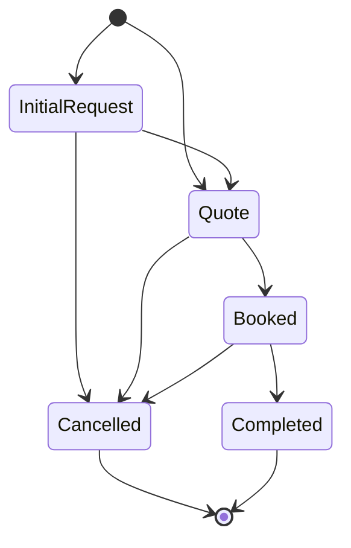

# booking-lifecycle

A small Kotlin/JVM library for expressing a booking lifecycle directly through
application-owned domain types.

> **Requires Java 25.** The library is compiled to Java 25 bytecode, tested on Java 25,
> and requires a Java 25 or newer runtime. Older JVMs are not supported. See
> [Requirements](#requirements).

`booking-lifecycle` does not own your booking data. It gives your booking-domain types a
common lifecycle vocabulary and a compile-time topology of legal transitions.

> The library owns the booking lifecycle type hierarchy and its legal transition topology.
> Consuming applications own the concrete business data and the conditions necessary to
> perform those transitions.

Put shortly: **the library defines what may legally follow a lifecycle phase. Your
application defines whether, when, and how that transition occurs.**

## Contents

- [Why this exists](#why-this-exists)
- [The core idea](#the-core-idea)
- [Lifecycle](#lifecycle)
- [Lifecycle API](#lifecycle-api)
- [Implementing the lifecycle](#implementing-the-lifecycle)
- [Legal paths are expressed by capabilities](#legal-paths-are-expressed-by-capabilities)
- [The library defines legality, not business policy](#the-library-defines-legality-not-business-policy)
- [Covariant concrete return types](#covariant-concrete-return-types)
- [Application-owned data](#application-owned-data)
- [Quote and invoice revisions](#quote-and-invoice-revisions)
- [Terminal outcomes](#terminal-outcomes)
- [What this library is not](#what-this-library-is-not)
- [Requirements](#requirements)
- [Building and testing](#building-and-testing)
- [Using it from another build](#using-it-from-another-build)
- [Current scope](#current-scope)
- [Future direction](#future-direction)

## Why this exists

Many applications agree that a booking moves through the same broad phases:

```text
InitialRequest → Quote → Booked → Completed
```

They disagree completely about what the objects in those phases contain. A caterer's
booking might carry:

```text
customer, menu selections, guest count, deposit, invoice
```

An equipment rental's booking might carry:

```text
renter, equipment list, rental dates, security hold
```

The two apps share the lifecycle topology: which phases exist and which may follow which.
They don't share business data. This library captures the shared part and leaves the rest
to each application.

## The core idea

**Application models implement lifecycle phase interfaces directly.**

```kotlin
data class CateringQuote(
    val customerId: UUID,
    val total: BigDecimal,
) : BookingLifecycle.Active.Quote {
    // transition implementations, shown below
}
```

`CateringQuote` does not *contain* the `Quote` phase. It *is* your application's
concrete representation of the `Quote` phase.

This library is deliberately **not** centered on a state property such as:

```kotlin
data class Booking(
    val state: BookingState, // not the model this library is built around
)
```

A lifecycle does not advance by mutating a `state` field. It advances when one
lifecycle-typed application model is transformed into the next:
`CateringQuote.toBooking()` returns a `CateringBooking`.

## Lifecycle



The transition functions on each phase:

```text
InitialRequest
 ├── toQuote() ───→ Quote
 └── cancel() ────→ Cancelled

Quote
 ├── toBooking() ─→ Booked
 └── cancel() ────→ Cancelled

Booked
 ├── complete() ──→ Completed
 └── cancel() ────→ Cancelled

Completed
 └── no lifecycle transitions

Cancelled
 └── no lifecycle transitions
```

### Two entry points

A lifecycle can begin at either of two phases:

- **`InitialRequest`**: a customer submits an inquiry through your application.
- **`Quote`**: the opportunity started outside your application (a phone call, a text,
  an email, an in-person conversation, another system), and the first thing your
  application records is an issued quote.

There is no library-owned factory or initial value. A lifecycle begins when you
construct a model that implements one of these two phases.

### Phases

| Phase | Classification | Meaning | Legal transitions |
|---|---|---|---|
| `InitialRequest` | Active | An inquiry or estimate request that has not yet become an official quote. | `toQuote()`, `cancel()` |
| `Quote` | Active | A booking opportunity for which an official quote has been issued. It can also be the entry point. | `toBooking()`, `cancel()` |
| `Booked` | Active | A confirmed booking. The library does not define what "confirmed" requires. | `complete()`, `cancel()` |
| `Cancelled` | Terminal | The lifecycle ended without fulfillment. | none |
| `Completed` | Terminal | The booked service or event was fulfilled. | none |

The application owns what each phase contains. An `InitialRequest` might hold customer
details, selections, notes, an estimate, or a requested date, but the lifecycle requires
none of these.

## Lifecycle API

This is the entire public API. It lives in
[`BookingLifecycle.kt`](src/main/kotlin/io/github/castab/bookinglifecycle/BookingLifecycle.kt),
shown here without KDoc:

```kotlin
package io.github.castab.bookinglifecycle

public sealed interface BookingLifecycle {

    public sealed interface Active : BookingLifecycle {

        public interface InitialRequest : Active {
            public fun toQuote(): Quote
            public fun cancel(): Terminal.Cancelled
        }

        public interface Quote : Active {
            public fun toBooking(): Booked
            public fun cancel(): Terminal.Cancelled
        }

        public interface Booked : Active {
            public fun complete(): Terminal.Completed
            public fun cancel(): Terminal.Cancelled
        }
    }

    public sealed interface Terminal : BookingLifecycle {

        public interface Cancelled : Terminal

        public interface Completed : Terminal
    }
}
```

### Why some interfaces are sealed and others open

```text
BookingLifecycle          sealed   (the library controls the taxonomy)
├── Active                sealed
│   ├── InitialRequest    open     (your types implement these)
│   ├── Quote             open
│   └── Booked            open
└── Terminal              sealed
    ├── Cancelled         open
    └── Completed         open
```

- **Sealed classifications.** `BookingLifecycle`, `Active`, and `Terminal` are sealed,
  so the set of phases is fixed by the library. Another module cannot add a sixth phase.
  The compiler rejects it with "Extending sealed classes or interfaces from a different
  module is prohibited". This also makes `when` over a `BookingLifecycle` exhaustive
  without an `else` branch.
- **Open phases.** The five phase interfaces are ordinary interfaces. Kotlin only
  restricts the *direct* subtypes of a sealed type to the declaring module, so your
  classes in any module can implement a phase:

```text
BookingLifecycle.Active.Quote              BookingLifecycle.Active.Quote
            ▲                                          ▲
            │                                          │
      CateringQuote                              EquipmentQuote
   (catering application)                    (rental application)
```

The library controls the lifecycle vocabulary. Your application controls the concrete
representation.

Code that only knows the protocol can still handle any adopter's models exhaustively:

```kotlin
fun describe(phase: BookingLifecycle): String =
    when (phase) {
        is BookingLifecycle.Active.InitialRequest -> "Inquiry received"
        is BookingLifecycle.Active.Quote -> "Quote issued"
        is BookingLifecycle.Active.Booked -> "Booked"
        is BookingLifecycle.Terminal.Completed -> "Completed"
        is BookingLifecycle.Terminal.Cancelled -> "Cancelled"
    }
```

## Implementing the lifecycle

Below is a complete application-owned chain for a catering business. It lives in the
application's own package. Every field and every type other than `BookingLifecycle`
belongs to the application, including `bookingId`: the library does not define booking
identity.

```kotlin
package com.example.catering

import io.github.castab.bookinglifecycle.BookingLifecycle
import java.math.BigDecimal
import java.time.LocalDate
import java.util.UUID

data class MenuSelection(val item: String, val servings: Int)

data class CateringInitialRequest(
    val bookingId: UUID,
    val customerId: UUID,
    val eventDate: LocalDate,
    val selections: List<MenuSelection>,
    val estimatedTotal: BigDecimal,
) : BookingLifecycle.Active.InitialRequest {

    override fun toQuote(): CateringQuote =
        CateringQuote(bookingId, customerId, eventDate, selections, total = estimatedTotal)

    override fun cancel(): CancelledCateringInquiry =
        CancelledCateringInquiry(bookingId, customerId)
}

data class CateringQuote(
    val bookingId: UUID,
    val customerId: UUID,
    val eventDate: LocalDate,
    val selections: List<MenuSelection>,
    val total: BigDecimal,
    val revision: Int = 1,
) : BookingLifecycle.Active.Quote {

    // A revision is application data. The result still inhabits the Quote phase.
    fun revise(newTotal: BigDecimal): CateringQuote =
        copy(total = newTotal, revision = revision + 1)

    override fun toBooking(): CateringBooking =
        CateringBooking(bookingId, customerId, eventDate, selections, invoiceTotal = total)

    override fun cancel(): DeclinedCateringQuote =
        DeclinedCateringQuote(bookingId, customerId, quotedTotal = total)
}

data class CateringBooking(
    val bookingId: UUID,
    val customerId: UUID,
    val eventDate: LocalDate,
    val selections: List<MenuSelection>,
    val invoiceTotal: BigDecimal,
    val invoiceVersion: Int = 1,
) : BookingLifecycle.Active.Booked {

    // A change order produces a new invoice version. The result still inhabits Booked.
    fun applyChangeOrder(added: MenuSelection, cost: BigDecimal): CateringBooking =
        copy(
            selections = selections + added,
            invoiceTotal = invoiceTotal + cost,
            invoiceVersion = invoiceVersion + 1,
        )

    override fun complete(): CompletedCateringBooking =
        CompletedCateringBooking(bookingId, customerId, eventDate, finalTotal = invoiceTotal)

    override fun cancel(): CancelledCateringBooking =
        CancelledCateringBooking(bookingId, customerId, eventDate)
}

data class CompletedCateringBooking(
    val bookingId: UUID,
    val customerId: UUID,
    val eventDate: LocalDate,
    val finalTotal: BigDecimal,
) : BookingLifecycle.Terminal.Completed

data class CancelledCateringInquiry(
    val bookingId: UUID,
    val customerId: UUID,
) : BookingLifecycle.Terminal.Cancelled

data class DeclinedCateringQuote(
    val bookingId: UUID,
    val customerId: UUID,
    val quotedTotal: BigDecimal,
) : BookingLifecycle.Terminal.Cancelled

data class CancelledCateringBooking(
    val bookingId: UUID,
    val customerId: UUID,
    val eventDate: LocalDate,
) : BookingLifecycle.Terminal.Cancelled
```

Walking the canonical path:

```kotlin
val request = CateringInitialRequest(
    bookingId = UUID.randomUUID(),
    customerId = UUID.randomUUID(),
    eventDate = LocalDate.of(2026, 11, 14),
    selections = listOf(MenuSelection("Tamales", servings = 80)),
    estimatedTotal = BigDecimal("1200.00"),
)

val quote: CateringQuote = request.toQuote()
val booking: CateringBooking = quote.toBooking()
val completed: CompletedCateringBooking = booking.complete()

// or, as one expression
request.toQuote().toBooking().complete()
```

The application also picks a concrete cancellation type for each point where the
lifecycle can end: `CancelledCateringInquiry`, `DeclinedCateringQuote`, and
`CancelledCateringBooking`. All three implement `BookingLifecycle.Terminal.Cancelled`. The
protocol cares about the outcome. The application keeps control of the data that
records it.

## Legal paths are expressed by capabilities

The transition methods are the state machine. The library has no separate transition
table, runtime validator, or `transition(from, to)` function. Each phase exposes only the
transitions that may legally follow it.

`Quote.toBooking()` expresses that `Quote → Booked` is a valid lifecycle edge. An edge
that is not legal has no method, so calling it does not compile:

```kotlin
initialRequest.complete()   // error: Unresolved reference 'complete'   (InitialRequest cannot complete)
initialRequest.toBooking()  // error: Unresolved reference 'toBooking'  (it must be quoted first)
quote.complete()            // error: Unresolved reference 'complete'   (a quote must be booked first)
completed.cancel()          // error: Unresolved reference 'cancel'     (terminal phases have no transitions)
completed.toBooking()       // error: Unresolved reference 'toBooking'
cancelled.toQuote()         // error: Unresolved reference 'toQuote'
```

Illegal paths are not rejected at runtime, because they cannot be written in the first
place. `Completed` and `Cancelled` declare no members at all, so there is no
lifecycle-native way to leave a terminal phase.

This design makes the right path easy. It does not sandbox your code. Nothing stops an
application from constructing a `CompletedCateringBooking` directly, and nothing in
the type system stops a single class from implementing two phases. Phases are meant to be
mutually exclusive, so give each concrete type exactly one phase interface. The library
makes the canonical lifecycle natural and leaves illegal edges out of the lifecycle API.
It does not police all application code.

## The library defines legality, not business policy

> Transition methods represent legal lifecycle edges, not the business prerequisites
> necessary to traverse those edges.

`fun toBooking(): Booked` means that `Quote → Booked` is a legal lifecycle transition. It
does **not** mean the library has checked that the booking's business requirements are
met. The library has no concept of deposits, payments, contracts, acceptance,
approval, availability, identity, timestamps, or actors.

Each application decides for itself. For example, a caterer that requires an accepted quote
and a 25% deposit before confirming might write:

```kotlin
data class CateringQuote(
    // ...fields as above, plus:
    val acceptedAt: Instant?,
    val depositReceived: BigDecimal,
) : BookingLifecycle.Active.Quote {

    override fun toBooking(): CateringBooking {
        checkNotNull(acceptedAt) { "Quote for booking $bookingId has not been accepted" }
        require(depositReceived >= total * DEPOSIT_RATE) { "Deposit for booking $bookingId is below 25%" }
        return CateringBooking(bookingId, customerId, eventDate, selections, invoiceTotal = total)
    }

    // cancel() as before

    private companion object {
        val DEPOSIT_RATE = BigDecimal("0.25")
    }
}
```

An equipment rental business may confirm unconditionally:

```kotlin
data class EquipmentQuote(
    val renterId: UUID,
    val equipment: List<String>,
    val rentalDates: ClosedRange<LocalDate>,
    val securityHold: BigDecimal,
) : BookingLifecycle.Active.Quote {

    override fun toBooking(): EquipmentRental =
        EquipmentRental(renterId, equipment, rentalDates, securityHold)

    override fun cancel(): ExpiredEquipmentQuote =
        ExpiredEquipmentQuote(renterId)
}
```

A third might require a signed contract, and a fourth, staff approval. These are all
valid adopters. The checks above are examples of *one* application's policy, not
requirements of the protocol. How a failed check is reported (exception, `Result`,
sealed outcome, or a check performed before `toBooking()` is ever called) is also the
application's choice.

## Covariant concrete return types

The protocol declares the most general return type:

```kotlin
public fun toBooking(): BookingLifecycle.Active.Booked
```

Kotlin allows an override to return a subtype, so an adopter can declare its own type:

```kotlin
override fun toBooking(): CateringBooking   // CateringBooking : BookingLifecycle.Active.Booked
```

Callers holding the concrete type keep concrete types through the whole lifecycle, with
no casts:

```kotlin
val booking: CateringBooking = quote.toBooking()
val completed: CompletedCateringBooking = booking.complete()
```

Callers holding only the protocol type get the protocol type:

```kotlin
val someQuote: BookingLifecycle.Active.Quote = quote
val someBooking: BookingLifecycle.Active.Booked = someQuote.toBooking()
```

## Application-owned data

This library does not own, define, or constrain any of the following:

- customer models or customer identity
- staff identity or actors
- booking identity (how a quote and its booking are known to be the same booking)
- selections, line items, or estimates
- quote contents and quote versions
- invoice details and invoice versions
- payments and deposits
- cancellation reasons
- refunds and complaints
- timestamps
- persistence structure

Every example type above (`MenuSelection`, `CateringQuote`, `bookingId`, `invoiceVersion`,
...) is application code. The library compiles without knowing what any of it means.

## Quote and invoice revisions

Revisions change data *within* a phase. They do not move a booking to another phase.

```text
Quote v1  →  Quote v2  →  Quote v3          (still Quote)

Invoice v1 → change order → Invoice v2 → change order → Invoice v3   (still Booked)
```

In the catering example:

```kotlin
val revised: CateringQuote = quote
    .revise(BigDecimal("1150.00"))
    .revise(BigDecimal("1100.00"))          // revision == 3, still a BookingLifecycle.Active.Quote

val changed: CateringBooking = revised.toBooking()
    .applyChangeOrder(MenuSelection("Churros", servings = 80), BigDecimal("160.00"))
    .applyChangeOrder(MenuSelection("Horchata", servings = 80), BigDecimal("90.00"))
                                            // invoiceVersion == 3, still a BookingLifecycle.Active.Booked
```

Quote revisions stay application-owned data while the model continues to inhabit the
`Quote` phase. The same holds for invoice revisions in the `Booked` phase. That is why the
library has no `QuoteRevised`, `InvoiceSent`, or `InvoiceRevised` phase.

## Terminal outcomes

> Terminal booking phases are immutable historical outcomes of the booking lifecycle.

Once a booking reaches `Completed` or `Cancelled`, its lifecycle outcome does not change.
`Completed` means the booked service was fulfilled. `Cancelled` means the lifecycle ended
without fulfillment.

Being terminal with respect to the booking lifecycle **does not** mean all business
activity around the booking has ended:

```text
InitialRequest → Quote → Booked → Completed
                                     ⋮
                         customer complaint → refund
```

The lifecycle is still `Completed`, because the service was fulfilled. Likewise,
`Booked → Cancelled` may be followed by a refund, and the lifecycle is still `Cancelled`,
because fulfillment never happened.

Model such activity as separate, application-owned processes that refer to the booking:

```kotlin
data class Refund(val bookingId: UUID, val amount: BigDecimal, val reason: String)

val refund = Refund(completed.bookingId, BigDecimal("150.00"), reason = "late delivery")
// `completed` is still a BookingLifecycle.Terminal.Completed
```

Those processes can have lifecycles of their own. The combinations below describe
different historical situations, even though money is returned in both:

| Booking lifecycle | Payment process (application-owned) | What happened |
|---|---|---|
| `Completed` | refunded | The service was delivered, then money was returned. |
| `Cancelled` | refunded | The service never happened, and money was returned. |

Payments, refunds, complaints, disputes, chargebacks, invoicing, settlement, customer
support, and accounting are orthogonal to the booking lifecycle. For that reason there
are no phases such as `CompletedRefunded`, `PartiallyRefunded`, `DepositPaid`,
`ChargebackReceived`, or `ComplaintOpened`.

## What this library is not

It is not:

- an ORM or a persistence framework;
- a workflow engine or a runtime policy engine;
- a universal booking aggregate or booking data model;
- a payment library;
- a quote engine or an invoice engine;
- a state enum wrapper.

## Requirements

| | Version | Notes |
|---|---|---|
| Java | **25** | Hard requirement. The bytecode targets Java 25 (class file version 69). The build uses a Java 25 toolchain and fails if none is installed, because auto-download is disabled. |
| Kotlin | 2.4.20 | Compiler and Gradle plugin used to build the library. `kotlin-stdlib` 2.4.20 is the only runtime dependency. |
| Gradle | 9.7.0 | Pinned through the wrapper (with checksum), used to build this repository. You don't need Gradle to *consume* the library. |

The Java 25 requirement is intentional. Do not expect a build targeting 17 or 21.

Versions are declared in [`gradle/libs.versions.toml`](gradle/libs.versions.toml) and
[`build.gradle.kts`](build.gradle.kts).

## Building and testing

```bash
./gradlew clean test
```

On Windows:

```powershell
.\gradlew.bat clean test
```

The build cache is enabled. To make the tests run again rather than reuse cached results,
add `--no-build-cache` (or run `./gradlew test --rerun`).

Tests are written with [Kotest](https://kotest.io) 6.2.3 (`FunSpec`, Kotest assertions) on
the JUnit Platform. They use concrete test-owned fixtures for lifecycle behavior and
[MockK](https://mockk.io) 1.14.11 for one mocking test. MockK works on Java 25 as
resolved, with Byte Buddy 1.18.2, and needs no dependency override. Test dependencies
are not part of the library's runtime or API dependencies.

## Using it from another build

The library is not published to any repository yet, and no publishing is configured.
You can consume it today with a Gradle
[composite build](https://docs.gradle.org/current/userguide/composite_builds.html):

```kotlin
// settings.gradle.kts of the consuming build
includeBuild("../booking-lifecycle")
```

```kotlin
// build.gradle.kts of the consuming build
kotlin {
    jvmToolchain(25)
}

dependencies {
    implementation("io.github.castab:booking-lifecycle:0.1.0-SNAPSHOT")
}
```

## Current scope

What exists today:

- the `BookingLifecycle` protocol: 3 sealed classifications, 5 open phase interfaces, and
  6 abstract transition functions;
- KDoc on every public declaration;
- a Kotest suite covering adopter-owned fixtures, legal paths, cancellation from every
  active phase, phase classification, covariant returns, terminal shape, and MockK.

What does not exist: persistence, serialization, events, framework integrations, runtime
validation, publishing, or any business model.

## Future direction

The following is directional only, and no future module is guaranteed. The library may
later be split into modules such as:

```text
booking-lifecycle-core
booking-lifecycle-persistence
booking-lifecycle-jdbi
booking-lifecycle-mongo
```

If that happens, the core lifecycle semantics documented here should stay
persistence-agnostic, and adapters should build on the core without changing its model.

For contributors and coding agents: the architectural rules for changing this repository
are in [`AGENTS.md`](AGENTS.md).
